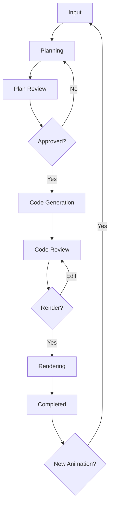

# Manim Animation Generator - Next.js Frontend

A modern, stage-based web application for generating mathematical animations using AI and Manim.

## 🎨 Tech Stack

- **Next.js 14** - React framework with App Router
- **TypeScript** - Type-safe development
- **Tailwind CSS** - Utility-first styling
- **Zustand** - Lightweight state management
- **Lucide React** - Beautiful icons
- **Framer Motion** - Smooth animations (ready to use)

## 📁 Project Structure

```
frontend-next/
├── app/
│   ├── globals.css          # Global styles with Tailwind
│   ├── layout.tsx           # Root layout
│   └── page.tsx             # Home page
├── components/
│   ├── AnimationWorkflow.tsx    # Main workflow orchestrator
│   ├── ErrorDisplay.tsx         # Error handling UI
│   ├── ProgressIndicator.tsx    # Stage progress bar
│   └── stages/
│       ├── InputStage.tsx           # 1. User input form
│       ├── PlanningStage.tsx        # 2. AI planning indicator
│       ├── PlanReviewStage.tsx      # 3. Review/edit plan
│       ├── CodeGenerationStage.tsx  # 4. Code generation indicator
│       ├── CodeReviewStage.tsx      # 5. Review/edit code
│       ├── RenderingStage.tsx       # 6. Rendering progress
│       └── CompletedStage.tsx       # 7. Video player & download
├── lib/
│   └── api.ts               # API service layer
├── store/
│   └── animation.ts         # Zustand state management
├── types/
│   └── api.ts               # TypeScript interfaces
└── tailwind.config.ts       # Tailwind configuration

```

## 🎯 Features

### Stage-Based Workflow
1. **Input Stage** - Describe your animation with helpful examples
2. **Planning Stage** - AI generates detailed animation plan
3. **Plan Review** - Review objects, timeline, approve or request changes
4. **Code Generation** - AI creates Manim Python code
5. **Code Review** - View, edit, and validate the generated code
6. **Rendering** - Manim renders the animation
7. **Completed** - Watch, download, or create new animation

### Modern UI/UX
- ✨ Beautiful gradient backgrounds
- 🎨 Glass morphism effects
- 🌊 Smooth transitions and animations
- 📱 Fully responsive design
- ⚡ Real-time progress tracking
- 🎭 Stage-specific loading states
- 🔄 Automatic status polling

### Developer Experience
- 🔷 Full TypeScript support
- 🏪 Centralized state management with Zustand
- 🎨 Utility-first styling with Tailwind
- 🧩 Modular component architecture
- 🔧 Easy API configuration via environment variables

## 🚀 Running the Application

### Prerequisites
- Node.js 18+ installed
- Backend server running on port 8000

### Start Development Server
```bash
cd frontend-next
npm run dev
```

The app will be available at **http://localhost:3000**

### Build for Production
```bash
npm run build
npm start
```

## 🔧 Configuration

Edit `.env.local` to configure the backend URL:

```env
NEXT_PUBLIC_API_URL=http://localhost:8000/api/v1
```

## 🎨 Customization

### Colors
Edit `tailwind.config.ts` to customize the color palette:

```typescript
colors: {
  primary: { ... },
  secondary: { ... },
}
```

### Animations
All animations are defined in Tailwind config:
- `animate-fade-in` - Fade in effect
- `animate-slide-up` - Slide up effect
- `animate-pulse-slow` - Slow pulse effect

### Stages
Each stage is a separate component in `components/stages/`. Customize or add new stages as needed.

## 📦 Dependencies

### Core
- `next`: ^14.2.0
- `react`: ^18.3.0
- `react-dom`: ^18.3.0

### State & UI
- `zustand`: ^4.5.0
- `lucide-react`: ^0.363.0
- `framer-motion`: ^11.0.0

### Dev Tools
- `typescript`: ^5
- `tailwindcss`: ^3.4.0
- `eslint-config-next`: 14.2.0

## 🏗️ Architecture

### State Management
Zustand store manages:
- Session ID
- Current status
- Animation plan
- Generated code
- Loading states
- Error handling

### API Layer
`ApiService` class handles all backend communication:
- Create animation
- Poll status
- Get/update plan
- Get/update code
- Trigger rendering
- Get video URL

### Component Flow
```
AnimationWorkflow (orchestrator)
  ↓
ProgressIndicator (shows current stage)
  ↓
Stage Components (render based on status.stage)
  ↓
API Service (communicates with backend)
  ↓
Zustand Store (updates global state)
```

## 🎭 Stage Workflow



## 🐛 Troubleshooting

### Backend Connection Issues
- Ensure backend is running on port 8000
- Check CORS settings in backend allow localhost:3000
- Verify `.env.local` has correct API URL

### Build Errors
- Clear `.next` folder: `rm -rf .next`
- Delete `node_modules` and reinstall: `rm -rf node_modules && npm install`
- Check TypeScript errors: `npm run lint`

## 📝 License

This project is part of the Manim Animation Generator system.
